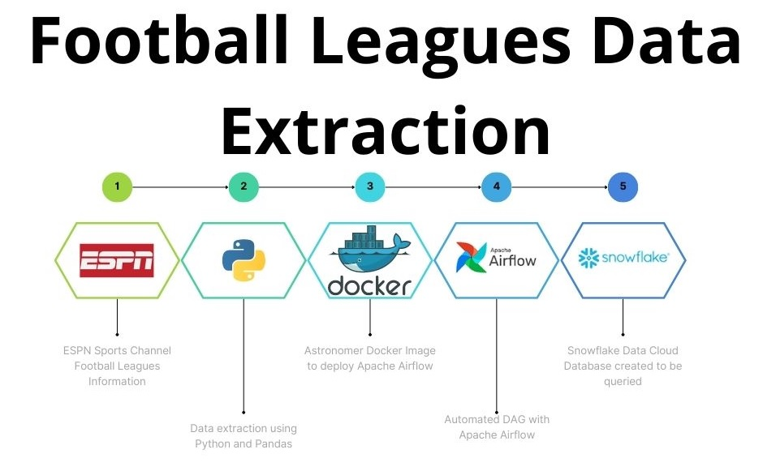

This project extracts football league information from the ESPN website using a combination of the following technologies:

* Airflow: Scheduling and orchestration of data extraction processes
* Docker: Containerization of the application and its dependencies
* Python: Data extraction and parsing logic
* Snowflake: Data storage and analysis

## The extracted information is loaded into Snowflake and can be queried and visualized for further analysis.